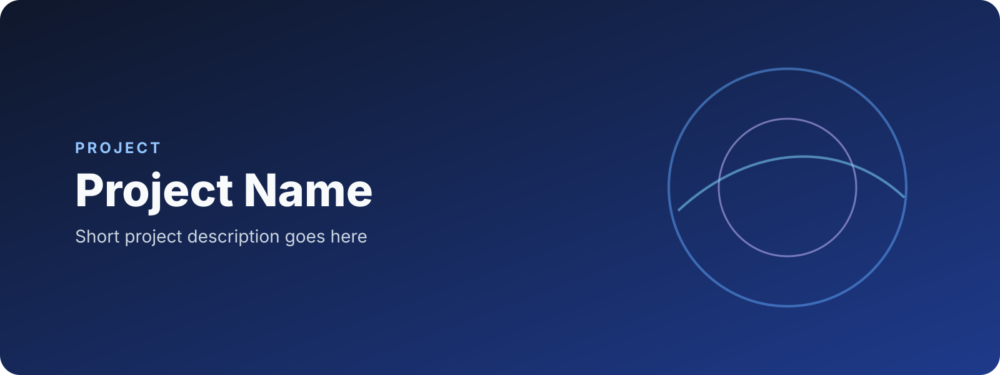
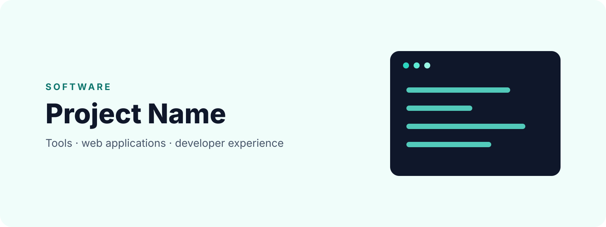

# Starter Asset Catalog

This catalog previews the reusable assets included in the initial visual system.

## Repository identity

### Repository mark

### Core palette

## README heroes

### Generic

### Geo / GIS

### Research

### AI / Data

### Software

## Templates

### Project cover

### Social preview

### Compact README banner

### Custom badge

## Background

> These are starter templates, not a final personal/lab brand identity. Project-specific kits can evolve while continuing to use the shared design tokens and workflow.
