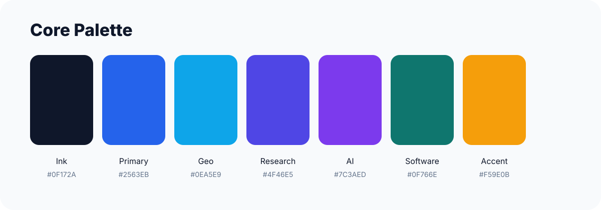
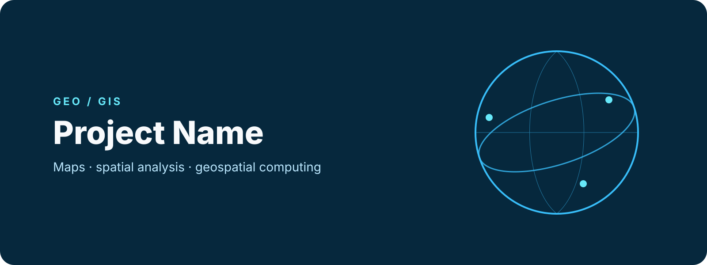
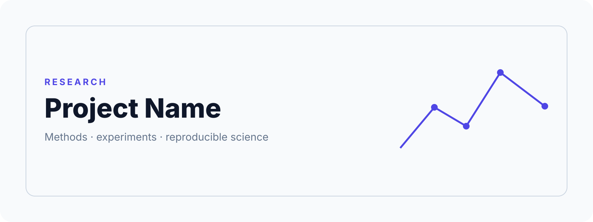
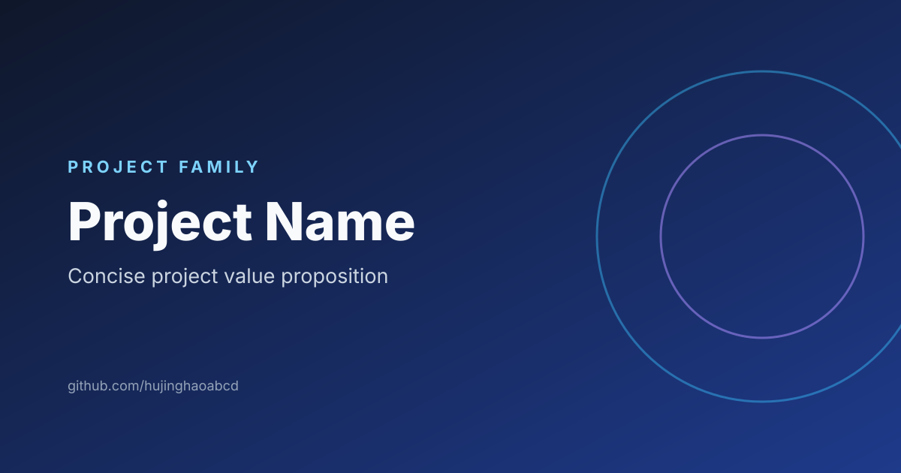
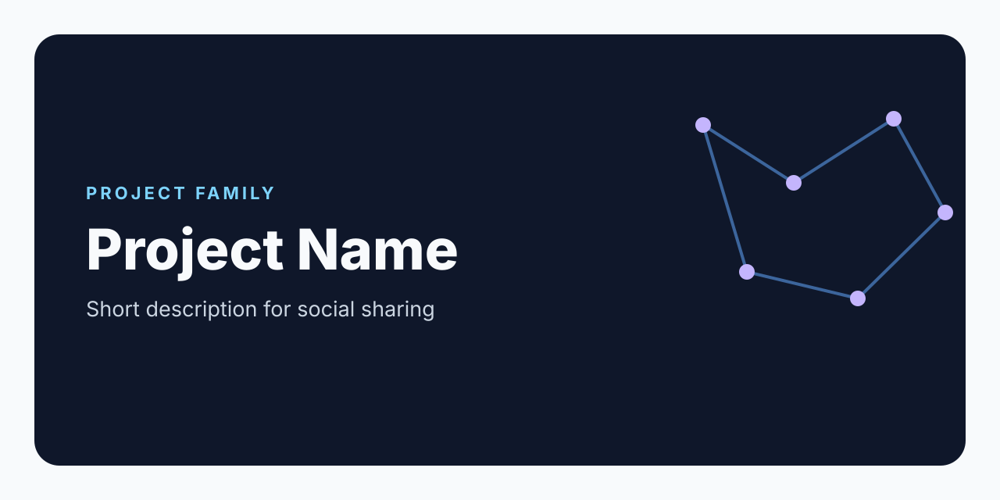
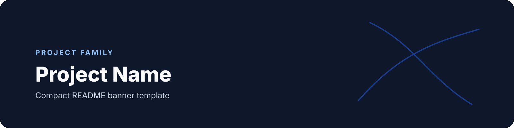

# Starter Asset Catalog

## Repository identity

### Repository mark

### Core palette

## Shared README heroes

### Generic

### Geo / GIS

### Research

### AI / Data

### Software

## Templates

### Project cover

### Social preview

### Compact README banner

### Custom badge

## Background

> Large logo collections are indexed by the future site and manifests rather than rendered as a giant Markdown page.
