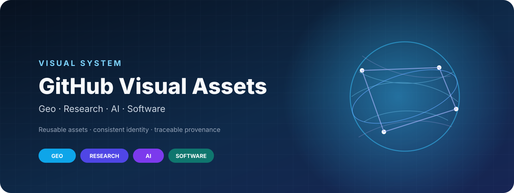

<p align="center">
  
</p>

<h1 align="center">GitHub Visual Assets</h1>

<p align="center">
  A reusable visual design system for GitHub profiles, research repositories, Geo/GIS projects, AI projects, Python packages, and web applications.
</p>

<p align="center">
  <strong>统一品牌 · 可复用模板 · 可追溯版权 · 面向 GitHub 的项目视觉资产库</strong>
</p>

<p align="center">
  <a href="https://github.com/hujinghaoabcd/github-visual-assets/actions/workflows/validate-assets.yml"></a>
  
  
</p>

---

## Overview / 项目简介

This repository is the central visual asset library for my GitHub projects. It separates editable sources from publish-ready exports, keeps third-party licenses traceable, and provides reusable templates for README heroes, project covers, social previews, architecture diagrams, badges, icons, screenshots, and animations.

这个仓库用于集中管理 GitHub 个人主页与各类开源项目的视觉资产，目标不是简单“存图片”，而是建立一套可长期复用的项目视觉设计系统：统一 Logo、色彩、字体、Banner、封面、插画、动图、图标、架构图和 README 展示规范。

## Design families / 四类视觉语言

| Family | Usage | Visual direction |
|---|---|---|
| **Geo / GIS** | maps, spatial analysis, geospatial tools | earth, map lines, grids, cyan/blue |
| **Research** | papers, algorithms, scientific code | restrained, clean, publication-oriented |
| **AI / Data** | GNN, deep learning, data science | nodes, graphs, data flow, indigo/violet |
| **Software** | Django, web apps, developer tools | modern product UI, teal/blue |

All families share the same base tokens, typography rules, spacing, icon logic, and asset naming conventions.

## Repository structure / 目录结构

```text
github-visual-assets/
├── brand/                  # Logo, avatar, colors, typography, repository identity
├── banners/                # README / docs / profile banners by family
├── illustrations/          # Curated illustrations by topic
├── animations/             # GIF / SVG / Lottie animation assets
├── icons/                  # Technology, GIS, science, database, cloud icons
├── badges/                 # Static, Shields.io and custom badges
├── backgrounds/            # Light, dark, gradient, grid, map backgrounds
├── project-covers/         # Per-project visual kits and covers
├── screenshots/            # Product / UI screenshots
├── templates/              # README, hero, cover, social-preview, diagram templates
├── source/                 # Editable master files
├── exports/                # Publish-ready SVG / PNG / WebP / GIF
├── manifest/               # Asset provenance metadata
├── scripts/                # Validation helpers
├── docs/                   # Style guide and workflow documentation
└── .github/                # CI and issue templates
```

## Starter gallery / 初始视觉模板

See the visual catalog in [`CATALOG.md`](CATALOG.md). The starter set includes Generic, Geo/GIS, Research, AI/Data, and Software README heroes, a project-cover template, a social-preview template, palette preview, repository mark, gradient background, and badge examples.

## Core asset sizes / 推荐尺寸

| Asset | Recommended size |
|---|---:|
| Avatar | 800 × 800 |
| README Hero | 1600 × 600 |
| Compact README Banner | 1600 × 400 |
| Social Preview | 1280 × 640 |
| Project Cover | 1200 × 630 |
| Square Project Card | 1000 × 1000 |
| Documentation Header | 1600 × 360 |
| Logo master | SVG |
| Logo raster export | 512 × 512 / 1024 × 1024 |

See [`docs/ASSET_SPEC.md`](docs/ASSET_SPEC.md) for the full specification.

## Starter design tokens / 基础视觉变量

| Token | Value | Purpose |
|---|---|---|
| `ink` | `#0F172A` | primary dark |
| `paper` | `#F8FAFC` | light background |
| `primary` | `#2563EB` | core brand blue |
| `geo` | `#0EA5E9` | GIS / geospatial |
| `research` | `#4F46E5` | research |
| `ai` | `#7C3AED` | AI / data |
| `software` | `#0F766E` | web / software |
| `accent` | `#F59E0B` | highlight |

Machine-readable tokens: [`brand/colors/tokens.json`](brand/colors/tokens.json).

## Standard project visual kit / 单项目标准资产包

```text
project-covers/<project>/
├── logo.svg
├── logo.png
├── hero.svg
├── hero-dark.svg
├── cover.png
├── architecture.svg
├── demo.gif
└── thumbnail.png
```

Use [`templates/project-kit/README.md`](templates/project-kit/README.md) when creating a new project kit.

## Usage in README / README 中引用

For cross-repository reuse, reference a stable file from this repository. For long-lived documentation, pin a release tag rather than relying forever on `main`.

```html
<p align="center">
  
</p>
```

## Workflow / 工作流

```text
collect / design
      ↓
source/                 editable master
      ↓
license + metadata      manifest + THIRD_PARTY.md
      ↓
export                  SVG / PNG / WebP / GIF
      ↓
validate                naming / size / source / license
      ↓
reuse                   README / docs / social preview
```

Detailed instructions: [`docs/WORKFLOW.md`](docs/WORKFLOW.md).

## Asset provenance / 素材版权

Every third-party asset must have a traceable source and license. Do **not** copy random images from GitHub, Google Images, Pinterest, blogs, or design galleries without confirming reuse rights.

- Code and helper scripts: [`LICENSE`](LICENSE) (MIT)
- Original visual assets created for this repository: [`LICENSE-ASSETS`](LICENSE-ASSETS) (CC BY 4.0)
- Third-party assets: register them in [`THIRD_PARTY.md`](THIRD_PARTY.md) and [`manifest/assets.yml`](manifest/assets.yml)

## Documentation

- [`docs/STYLE_GUIDE.md`](docs/STYLE_GUIDE.md) — visual system
- [`docs/ASSET_SPEC.md`](docs/ASSET_SPEC.md) — sizes and export rules
- [`docs/NAMING.md`](docs/NAMING.md) — naming conventions
- [`docs/WORKFLOW.md`](docs/WORKFLOW.md) — asset production workflow
- [`docs/README_INTEGRATION.md`](docs/README_INTEGRATION.md) — using assets across GitHub projects
- [`docs/LICENSING.md`](docs/LICENSING.md) — provenance and licensing rules
- [`docs/PROJECT_CHECKLIST.md`](docs/PROJECT_CHECKLIST.md) — per-project visual checklist

## Roadmap

- [x] Repository architecture
- [x] Visual tokens and starter SVG templates
- [x] Licensing and provenance system
- [x] README / project-cover / social-preview templates
- [x] Asset validation workflow
- [ ] Final personal / lab logo system
- [ ] Curated GIS / research / AI / software illustration collections
- [ ] Project kits for major repositories
- [ ] Reusable animated SVG / GIF library
- [ ] Automated visual catalog page

---

<p align="center"><sub>Built as long-term visual infrastructure for open-source and research projects.</sub></p>
